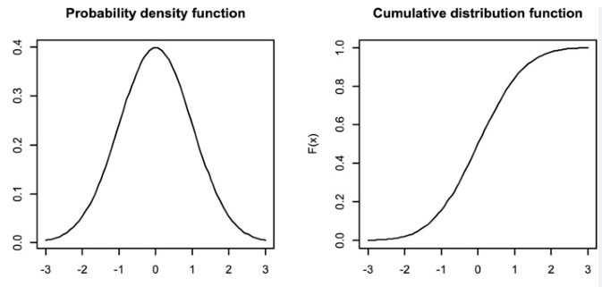

# Cumulative Distribution Function (CDF)

When you have **many samples** and a **PMF (Probability Mass Function)** becomes cluttered or unreadable, the **CDF (Cumulative Distribution Function)** gives a smoother, clearer view of the same data.

## How to Use CDF for a PMF

1. **Start from your discrete data or PMF.**

   - PMF gives \( P(X = x_i) \): the probability of each outcome.

2. **Compute the cumulative sum of probabilities.**

   - For each value \( x_i \):
     $$
     F(x_i) = \sum_{x_j \leq x_i} P(X = x_j)
     $$
   - This gives the probability that \( X \) is less than or equal to \( x_i \).

3. **Plot \( F(x) \):**
   - **x-axis:** possible outcomes
   - **y-axis:** cumulative probability (from 0 to 1)
   - The result is a _step function_ that starts at 0 and ends at 1.

## Why it Helps

- The CDF smooths out noise when you have many categories or samples.
- You can easily compare two distributions: whichever CDF rises faster has smaller values.
- It shows percentiles directly (e.g., the 50% mark gives the median).

## Example (Python)

```python
import numpy as np
import matplotlib.pyplot as plt

# sample PMF
x = np.array([1, 2, 3, 4, 5])
pmf = np.array([0.1, 0.3, 0.4, 0.15, 0.05])

# compute CDF
cdf = np.cumsum(pmf)

plt.step(x, cdf, where='post')
plt.xlabel('x')
plt.ylabel('CDF')
plt.show()
```

<br>


