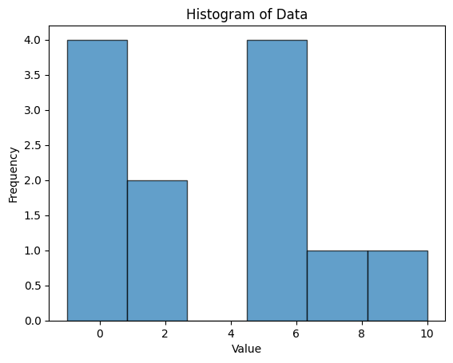

# Histogram

Usually used for continuous and univariate analysis.

## How plot a histogram

### 1. Collect Your Data

You need one numeric variable, for example:

```python
x = [0, 1, 1, 0, 5, 4.5, 7, 10, 0, 5, 6, -1]
```

---

### 2. Import Required Libraries

```python
import matplotlib.pyplot as plt
import numpy as np
```

---

### 3. Choose the Number of Bins (Intervals)

You can:

- Set it manually → `bins=6`
- Or let Python choose automatically → `bins='auto'`

#### How to Find the Number of Bins (Easy Method)

##### ✅ The Square Root Rule

The simplest way to choose the number of bins for a histogram is:

$$
\text{Number of bins} = \sqrt{n}
$$

Where:

- \( n \) = number of data points in your dataset.

---

##### 🧮 Examples

| Number of Data Points (n) | Number of Bins (√n) |
| ------------------------- | ------------------- |
| 25                        | 5                   |
| 64                        | 8                   |
| 100                       | 10                  |
| 400                       | 20                  |

---

##### 📘 Summary

Just take the **square root** of how many data points you have —  
that’s your recommended **number of bins** for a simple, balanced histogram.

### 4. Plot the Histogram

```python
plt.hist(x, bins=6, edgecolor='black', alpha=0.7)
plt.xlabel("Value")
plt.ylabel("Frequency")
plt.title("Histogram of Data")
plt.show()
```

This draws vertical bars representing how many values fall into each interval.

---

### 5. (Optional) Customize It

```python
plt.hist(x, bins=np.linspace(-2, 10, 7), color='skyblue', edgecolor='black', rwidth=0.9)
```

- `np.linspace(start, stop, n)` defines exact bin edges.
- `rwidth` controls spacing between bars.

---

### 6. Interpret

- **Tall bars** → many data points in that range.
- **Short bars** → few data points.
- **Shape** (bell, skewed, flat) → shows how your variable is distributed.

---

#### ✅ Summary

1. Have one numeric variable.
2. Decide number or edges of bins.
3. Use `plt.hist()`.
4. Label axes and interpret the pattern.
   <br>
   <br>
   
